# FortiOS FGCP HA A-P in AWS

## Table of Contents
  - [Overview](./README.md#overview)
  - [Solution Components](./README.md#solution-components)
  - [Failover Process](./README.md#failover-process)
  - [Terraform Templates](./README.md#terraform-templates)
  - [Deployment](./README.md#deployment)
  - [FAQ \ Tshoot](./README.md#faq--tshoot)

## Overview
FortiOS now supports using FGCP (FortiGate Clustering Protocol) in unicast form to provide an active-passive clustering solution for deployments in AWS.  This feature shares a majority of the functionality that FGCP on FortiGate hardware provides with key changes to support AWS SDN (Software Defined Networking).

This solution works with two FortiGate instances configured as a master and slave pair and requires that the instances are deployed in the same subnets and same availability zone within a single VPC.  These FortiGate instances act as a single logical instance and share interface IP addressing.

The main benefits of this solution are:
  - Fast and stateful failover of FortiOS and AWS SDN without external automation\services
  - Automatic AWS SDN updates to EIPs, ENI secondary IPs, and route targets
  - Native FortiOS session sync of firewall, IPsec\SSL VPN, and VOIP sessions 
  - Native FortiOS configuration sync
  - Ease of use as the cluster is treated as single logical FortiGate

For further information on FGCP reference the High Availability chapter in the FortiOS Handbook on the [Fortinet Documentation site](https://docs.fortinet.com).
 
**Note:**  Other Fortinet solutions for AWS such as dual AZ Lambda A-P failover, AutoScaling, and Transit VPC are available.  Please visit [www.fortinet.com/aws](https://www.fortinet.com/aws) for further information.	

**Reference Diagram:**


## Solution Components
FGCP HA provides AWS networks with enhanced reliability through device fail-over protection, link fail-over protection, and remote link fail-over protection. In addition, reliability is further enhanced with session fail-over protection for most IPv4 and IPv6 sessions including TCP, UDP, ICMP, IPsec\SSL VPN, and NAT sessions.

A FortiGate FGCP cluster appears as a single logical FortiGate instance and configuration synchronization allows you to configure a cluster in the same way as a standalone FortiGate unit. If a fail-over occurs, the cluster recovers quickly and automatically and can also send notifications to administrator so that the problem that caused the failure can be corrected and any failed resources restored.

The FortiGate instances will use multiple interfaces for data plane and control plane traffic to achieve FGCP clustering in an AWS VPC.  The FortiGate instances require four ENIs for this solution to work as designed so make sure to use an AWS EC2 instance type that supports this.   Reference AWS Documentation for further information on this.

For data plane functions the FortiGates will use two dedicated ENIs, one for a public interface (ie ENI0\port1) and another for a private interface (ie ENI1\port2).  These ENIs will utilize secondary IP addressing to allow both FortiGate instances to share the same IP address within the actual FortiOS configuration and sync sessions natively.  AWS does not allow modification of an ENI’s primary IP, thus secondary IP addressing must be used.  Reference AWS Documentation for further information on this.

The secondary IP addresses of the data plane ENIs will be assigned to the current master FortiGate’s ENIs and will be reassigned to another instance when a new master FortiGate instance is elected.  Additionally a cluster EIP will be associated to the secondary IP of the public interface (ie ENI0\port1) of the current master FortiGate instance and will be reassociated to a new master FortiGate instance as well.  

For control plane functions, the FortiGates will use a dedicated ENI (ie ENI2\port3) for FGCP HA communication to perform tasks such as heartbeat checks, configuration sync, and session sync.  A dedicated ENI is used as this is best practice for FGCP as it ensures the FortiGate instances have ample bandwidth for all critical HA communications.  

The FortiGates will also use another dedicated ENI (ie ENI3\port4) for HA management access to each instance and also allow each instance to independently and directly communicate with the public AWS EC2 API.  This dedicated interface is critical to failing over AWS SDN properly when a new FGCP HA master is elected and is the only method of access available to the current slave FortiGate instance.

The FortiGates are configured to use the unicast version of FGCP by applying the configuration below on both the master and slave FortiGate instances.  This configuration is automatically configured and bootstrapped to the instances when deployed by the provided Terrafom Templates.

#### Example Master FGCP Configuration:
    config system ha
    set group-name "group1"
    set mode a-p
    set hbdev "port3" 50
    set session-pickup enable
    set ha-mgmt-status enable
    config ha-mgmt-interface
    edit 1
    set interface port4
    set gateway 192.168.4.1
    next
    end
    set override disable
    set priority 255
    set unicast-hb enable
    set unicast-hb-peerip 192.168.3.12
    end

#### Example Slave FGCP Configuration:
    config system ha
    set group-name "group1"
    set mode a-p
    set hbdev "port3" 50
    set session-pickup enable
    set ha-mgmt-status enable
    config ha-mgmt-interface
    edit 1
    set interface port4
    set gateway 192.168.4.1
    next
    end
    set override disable
    set priority 1
    set unicast-hb enable
    set unicast-hb-peerip 192.168.3.11
    end

The FortiGate instances will make calls to the public AWS EC2 API to update AWS SDN to failover both inbound and outbound traffic flows to the new master FortiGate instance.  There are a few components that make this possible.

FortiOS will assume IAM permissions to access the AWS EC2 API by using the IAM instance role attached to the FortiGate instances.  The instance role is what grants the required permissions for FortiOS to:
  - Reassign secondary IP addressing on the data plane ENIs
  - Reassign cluster EIPs assigned to secondary IPs assigned to the data plane ENIs
  - Update existing routes to target the new master instance ENIs

The FortiGate instances will utilize their independent and direct internet access available through the FGCP HA management interface (ie ENI3\port4) to access the public AWS EC2 API.  It is critical that this ENI is in a public subnet with an EIP assigned so that each instance has independent and direct access to the internet or the AWS SDN will not reference the current master FortiGate instance which will break data plane traffic.

For further details on FGCP and it's components, reference the High Availability chapter in the FortiOS Handbook on the [Fortinet Documentation site](https://docs.fortinet.com).


## Failover Process
The following network diagram will be used to illustrate a failover event from the current master FortiGate (FortiGate 1), to the current slave FortiGate (FortiGate 2).

Inbound failover is provided by reassigning the secondary IP addresses of ENI0\port1 from FortiGate 1's public interface to FortiGate 2's public interface.  Additionally the EIPs associated to the secondary IP addresses of ENI0\port1 are reassociated from FortiGate 1's public interface to FortiGate 2's public interface.

Outbound failover is provided by reassigning the secondary IP addresses of ENI1\port2 from FortiGate 1's private interface to FortiGate 2's private interface.  Additionally any route targets referencing FortiGate 1’s private interface will be updated to reference FortiGate 2’s private interface.

The reassignment of secondary IPs is critical to allow synchronized sessions to resume traffic flow through FortiGate 2.

The AWS SDN is updates are performed by FortiGate 2 initiating API calls from the dedicated HA management interface (ie ENI3\port4) through the AWS Internet Gateway.

**Reference Diagram:**


## CloudFormation Templates
CloudFormation templates are available to simplify the deployment process and are available on the Fortinet Solutions GitHub repo. Here is the direct link to the [Fortinet Solutions Repo](https://github.com/fortinetsolutions/AWS-CloudFormationTemplates/).

These templates are organized into different folders based on the FortiOS version.  Once a FortiOS version is selected, four templates are available based on the license type and if the deployment is to create a new VPC or reference an existing one.  

Here is a list of the FGCP HA templates currently available in the [FortiOS 6.0  folder](https://github.com/fortinetsolutions/AWS-CloudFormationTemplates/blob/master/HA_Templates/6.0) of the repo:
  - [FGT_AP_NativeHA_NewVPC_BYOL](./FGT_AP_HA_NewVPC_BYOL.template.json)
  - [FGT_AP_NativeHA_NewVPC_PAYG](./FGT_AP_HA_NewVPC_PAYG.template.json)
  - [FGT_AP_NativeHA_ExistingVPC_BYOL](./FGT_AP_HA_ExistingVPC_BYOL.template.json)
  - [FGT_AP_NativeHA_ExistingVPC_PAYG](./FGT_AP_HA_ExistingVPC_PAYG.template.json)

These templates not only deploy AWS infrastructure but also bootstrap the FortiGate instances with the relevant network and FGCP HA configuration to support the VPC.  Most of this information is gathered as variables in the templates when a stack is deployed.  These variables are organized into these main groups:
-	VPC Configuration
-	FortiGate Instance Configuration
-	Interface IP Configuration for FortiGate 1
-	Interface IP Configuration for FortiGate 2
-	Interface IP Configuration for the Cluster

### VPC Configuration
In this section the parameters will request general information for either new or existing VPCs.  For new VPC templates, network CIDR values will be requested for the new VPC and subnets to be created.  For existing VPC templates, AWS resource IDs will need to be selected for the existing VPC and subnets.  For the new VPC templates, a default route will be added to the PrivateRouteTable targeting FortiGate 1’s ENI1\port2.  For the existing VPC templates, routes need to be added manually to the existing private route table(s) manually.  Below are examples of the template parameters for the new and existing VPC templates

#### Example New VPC Template Variables:
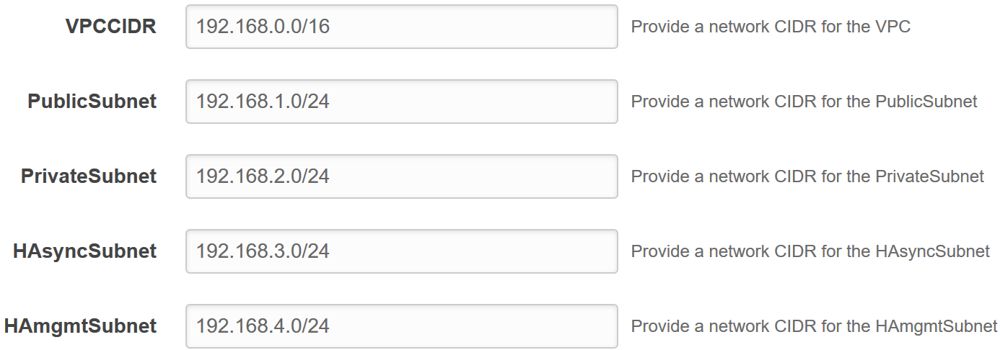

#### Example Existing VPC Template Variables:
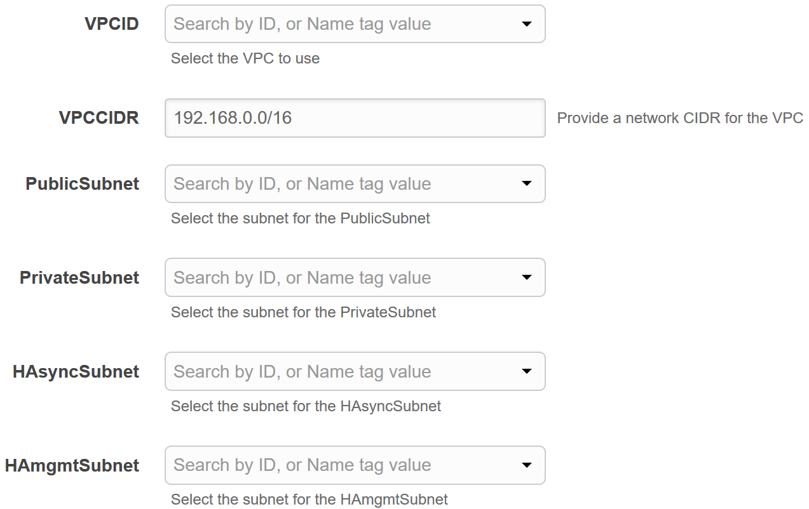

### FortiGate Instance Configuration
For this section the variables will request general instance information such as instance type, key pair, and Availability Zone to deploy the instances into.  Also FortiOS specific information will be requested such as the init S3 bucket, bucket region, and FortiGate License filenames if you are using the BYOL template.  Additional items such as the and IP addresses for AWS resources within the VPC such as the IP of the AWS intrinsic router for the public, private, and HAmgmt subnets.  The AWS intrinsic router is always the first host IP for each subnet.  Reference [AWS Documentation](https://docs.aws.amazon.com/vpc/latest/userguide/VPC_Subnets.html#VPC_Sizing) for further information on host IPs used by AWS services within a subnet.

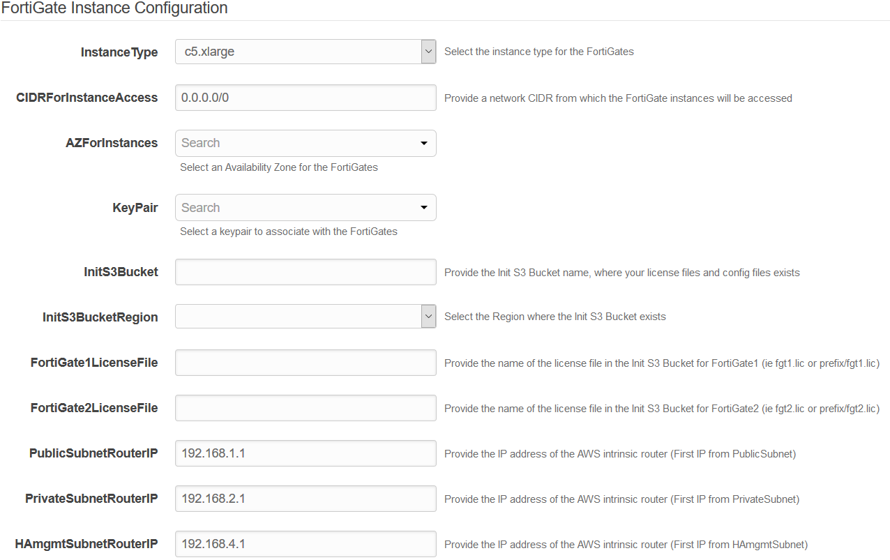

### Interface IP Configuration for FortiGate 1 & 2
The next two sections request IP addressing information to configure the primary IP addresses of ENIs of the FortiGate instances.  This information will also be used to bootstrap the configuration for both FortiGates.


### Interface IP Configuration for the Cluster
The last section requests IP addressing information to configure the secondary IP addresses of the public and private ENIs of FortiGate 1 as this is the master FortiGate on deployment.  This information will also be used to bootstrap the configuration of FortiGate 1.

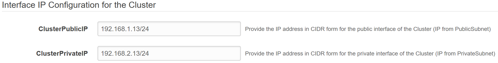


## Deployment
Before attempting to create a stack with the templates, a few prerequisites should be checked to ensure a successful deployment:
1.	An AMI subscription must be active for the FortiGate license type being used in the template.  
  * [BYOL Marketplace Listing](https://aws.amazon.com/marketplace/pp/B00ISG1GUG)
  * [PAYG Marketplace Listing](https://aws.amazon.com/marketplace/pp/B00PCZSWDA)
2.	The solution requires 3 EIPs to be created so ensure the AWS region being used has available capacity.  Reference [AWS Documentation](https://docs.aws.amazon.com/AWSEC2/latest/UserGuide/ec2-resource-limits.html) for more information on EC2 resource limits and how to request increases.
3.	If BYOL licensing is to be used, ensure these licenses have been registered on the support site.  Reference the VM license registration process PDF in this [KB Article](http://kb.fortinet.com/kb/microsites/search.do?cmd=displayKC&docType=kc&externalId=FD32312).
4.  If BYOL licensing is to be used, **create a new S3 bucket in the same region where the template will be deployed** and upload these licenses to the root directory.  **If the bucket is in a different region** than the template deployment, **bootstrapping will fail and both FGTs will be unaccessable**.
5.  If deploying into an existing VPC, ensure that an S3 gateway endpoint deployed and assigned to the PublicSubnet's AWS route table.  Reference [AWS Documentation](https://docs.aws.amazon.com/vpc/latest/userguide/vpce-gateway.html#create-gateway-endpoint) for further information.
6.  If deploying into an existing VPC, ensure that both the PublicSubnet's and HAmgmtSubnet's AWS route table has a default route to an AWS Internet Gateway.  Reference [AWS Documentation](https://docs.aws.amazon.com/vpc/latest/userguide/VPC_Route_Tables.html#route-tables-internet-gateway) for further information.

Once the prerequisites have been satisfied, login to your account in the AWS console and proceed with the deployment steps below.

----
1.  In the AWS services page under All Services > Management Tools, select CloudFormation.

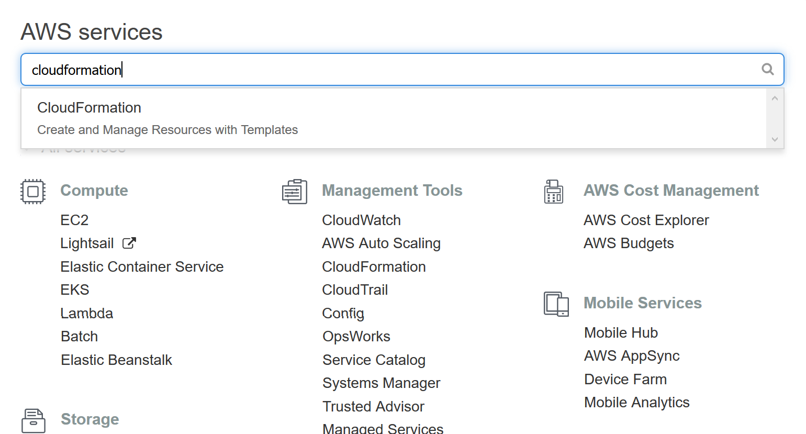

2.  Select Create New Stack.

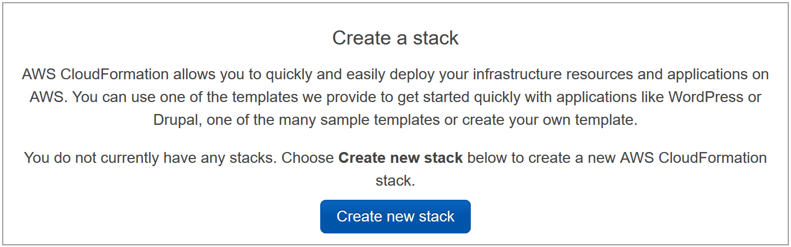
 
3.  On the Select Template page, under the Choose a Template section select Upload a template to Amazon S3 and browse to your local copy of the chosen deployment template.  In this example, we are using the ‘FGT_AP_HA_NewVPC_BYOL.template.json’ template.

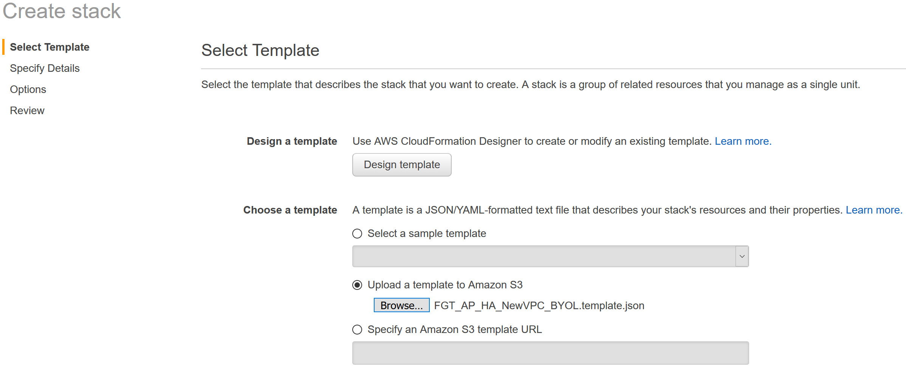

4.  On the Specify Details page, you will be prompted for a stack name and parameters for the deployment.  We are using a AWS resource IDs for a VPC created with the default values of the 'NewVPC_BaseSetup.template' template.

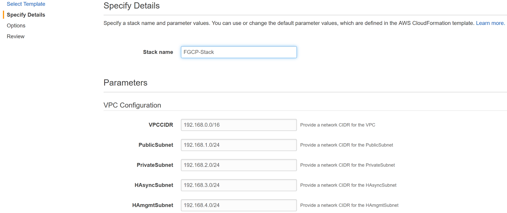

5.  In the FortiGate Instance Configuration parameters section, we have selected an Availability Zone and Key Pair to use for the FortiGates as well as BYOL licensing.  Notice, since we are using a BYOL template we are prompted for the InitS3Bucket, InitS3BucketRegion, FortiGate1LicenseFile, and FortiGate2LicenseFile parameters.  For the values we are going to reference the S3 bucket and relevant information from the deployment prerequisite step 4.

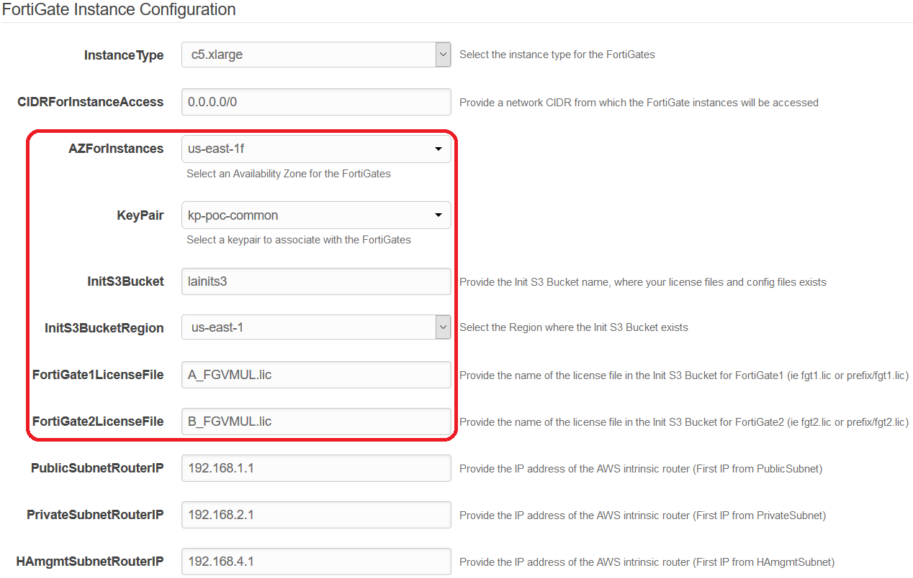

6.  In the Interface IP Configuration for the FortiGates parameters section, we are going with the defaults in this example as the subnet addressing matches.  These IPs will be the primary and secondary IPs assigned to the FortiGate ENIs.  These values will also be used as the static IPs in the FortiOS configuration for both FortiGates.

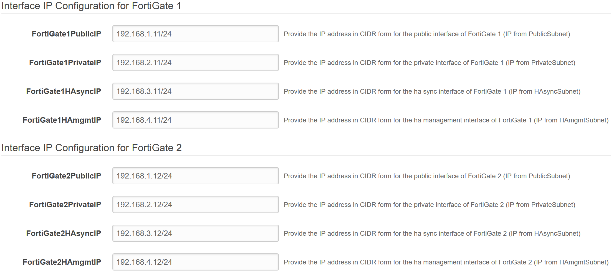

7.  In the Interface IP Configuration for the Cluster parameters section, we are going with the defaults in this example.  These IPs will be the secondary IPs associated to the master FortiGate instance ENIs and will be the static IPs used in the FortiOS configuration for both FortiGates when the cluster has synchronized.


8.  On the Options page, you can scroll to the bottom and select Next.
9.  On the Review page, confirm that the stack name and parameters are correct.  This is what the parameters look like in this example.  Notice the parameter values for the init S3 bucket, bucket region, and FortiGate License filenames.

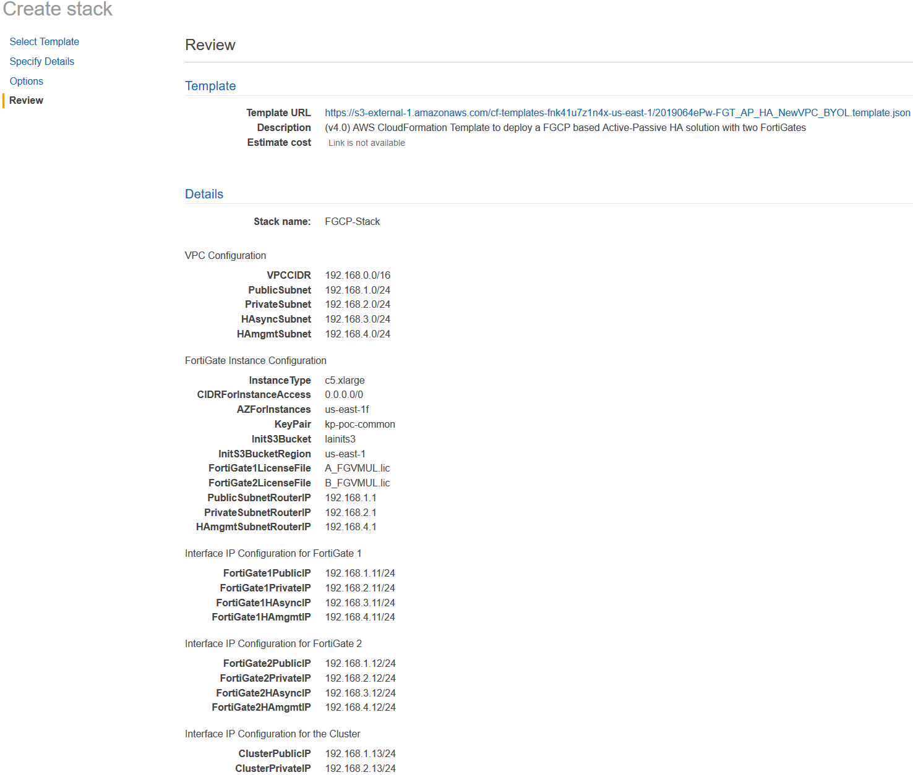

10.  On the Review page, scroll down to the capabilities section.  As the template will create IAM resources, you need to acknowledge this by checking the box next to ‘I acknowledge that AWS CloudFormation might create IAM resources’ and then click Create.

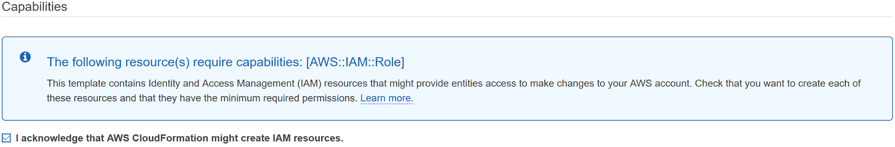

11.  On the main AWS CloudFormation console, you will now see your stack being created.  You can monitor the progress by selecting your stack and then select the Events tab.

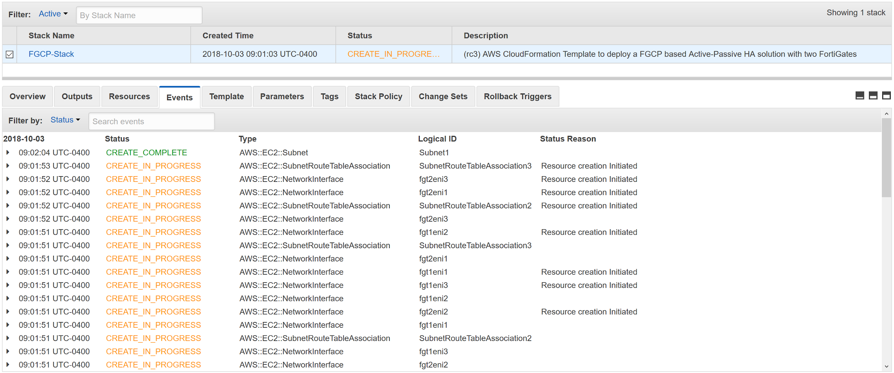

12.  Once the stack creation has completed successfully, select the Outputs tab to get the login information for the FortiGate instances and cluster.

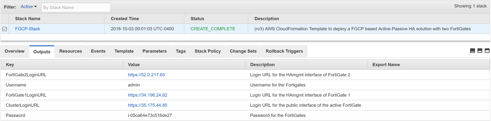

13.  Using the login information in the stack outputs, login to the master FortiGate instance with the ClusterLoginURL.  This should put you on FortiGate 1.


14.  Navigate to the HA status page on the master FortiGate by going to System > HA.  Now you should see both FortiGate 1 and FortiGate 2 in the cluster with FortiGate 2 as the current slave.


15.  Give the HA cluster time to finish synchronizing their configuration and update files.  You can confirm that both the master and slave FortiGates are in sync by looking at the Synchronized column and confirming there is a green check next to both FortiGates.

*** **Note:** Due to browser caching issues, the icon for Synchronization status may not update properly after the cluster is in-sync.  So either close your browser and log back into the cluster or alternatively verify the HA config sync status with the CLI command ‘get system ha status’. ***


16.  Navigate to the AWS EC2 console and reference the instance Description tab for FortiGate 1.  Notice the primary and secondary IPs assigned to the instance ENIs as well as the 2 EIPs associated to the instance, the Cluster EIP and the HAmgmt EIP.


17.  Now reference the instance Description tab for FortiGate 2.  Notice there are only primary IPs assigned to the instance ENIs and only one EIP is the HAmgmt EIP.


18.  Navigate to the AWS VPC console and reference the default route in the PrivateRouteTable with a next hop targeting ENI1\port2 of FortiGate 1.


19.  Navigate back to the AWS EC2 console and reference the instance Description tab for FortiGate 1.  Now shutdown FortiGate 1 via the EC2 console and refresh the page after a few seconds.  Notice that the Cluster EIP and secondary IPs are no longer assigned to FortiGate 1.

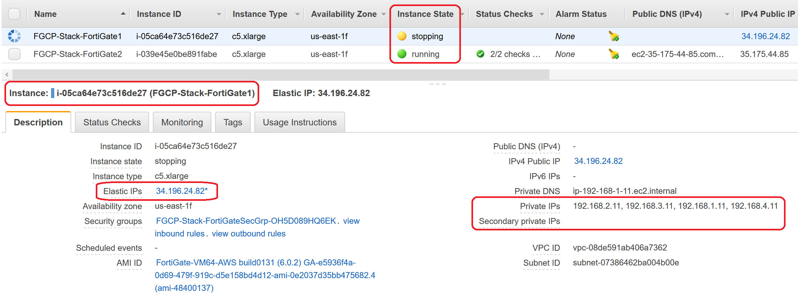

20.  Now reference the instance Description tab for FortiGate 2.  Notice that the Cluster EIP and secondary IPs are now associated to FortiGate 2.


21.  Navigate back to the AWS VPC console and look at the routes for the PrivateRouteTable which is associated to the PrivateSubnet.  The default route target is now pointing to ENI1\port2 of FortiGate 2.

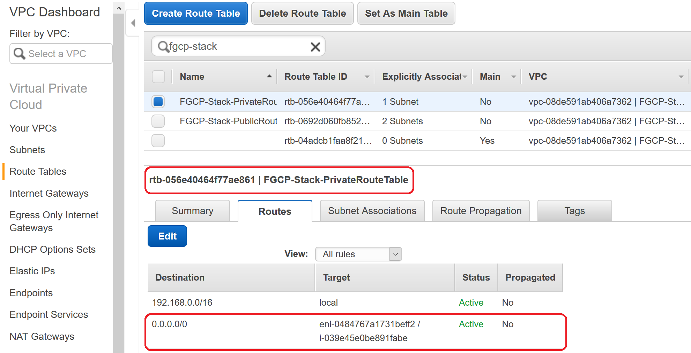

22.  Now log back into the cluster_login_url and you will be placed on the current master FortiGate, which should now be FortiGate 2.

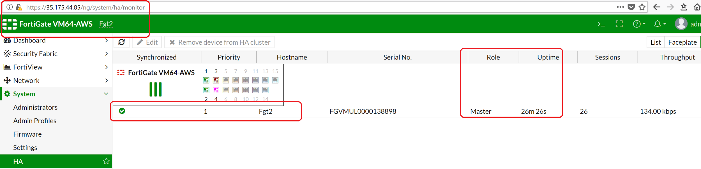

23.  Now power on FortiGate 1 and confirm that it joins the cluster successfully as the slave and FortiGate 2 continues to be the master FortiGate.


24.  This concludes the template deployment example.
----

## FAQ \ Tshoot
  - **Does FGCP support having multiple Cluster EIPs and secondary IPs on ENI0\port1?**

Yes.  FGCP will move over any secondary IPs associated to ENI0\port1 and EIPs associated to those secondary IPs to the new master FortiGate instance.  In order to configure additional secondary IPs on the ENI and in FortiOS for port1, reference this [use-case guide](https://www.fortinet.com/content/dam/fortinet/assets/solutions/aws/Fortinet_Multiple_Public_IPs_for_an_AWS_interface.pdf) on the Fortinet AWS micro site.

  - **Does FGCP support having multiple routes for ENI1\port2?**

Yes.  FGCP will move any routes (regardless of the network CIDR) found in AWS route tables that are referencing any of the current master FortiGate instance’s data plane ENIs (ENI0\port1, ENI1\port2, etc) to the new master on a failover event.

  - **What VPC configuration is required when deploying either of the existing VPC Terraform templates?**

The existing VPC Terraform templates are expecting the same VPC configuration that is provisioned in the new VPC Terraform templates.  The existing customer VPC would need to have 4 subnets in the same availability zone to cover the required Public, Private, HAsync, and HAmgmt subnets.  Also ensure that an S3 gateway endpoint deployed and assigned to the PublicSubnet's AWS route table.  Another critical point is that both the Public and HAmgmt subnets need to be configured as public subnets.  This means that an IGW needs to be attached to the VPC and a route table, with a default route using the IGW, needs to be associated to the Public and HAmgmt subnets.  

  - **During a failover test we see successful failover to a new master FortiGate instance, but then when the original master is online, it becomes master again.**

The master selection process of FGCP will ignore HA uptime differences unless they are larger than 5 minutes.  The HA uptime is visible in the GUI under System > HA.  This is expected and the default behavior of FortiOS but can be changed in the CLI under the ‘config system ha’ table.  For further details on FGCP master selection and how to influence the process, reference primary unit selection section of the High Availability chapter in the FortiOS Handbook on the [Fortinet Documentation site](https://docs.fortinet.com/).

  - **During a failover test we see FGCP select a new master but AWS SDN is not updated to point to the new master FortiGate instance.**

Confirm the FortiGates configuration are in-sync and are properly selecting a new master by seeing the HA role change as expected in the GUI under System > HA or CLI with ‘get sys ha status’.  However during a failover the secondary IPs of ENIs, routes, and Cluster EIPs are not updated, then your issue is likely to do with direct internet access via HAmgmt interface (ENI3\port4) of the FortiGates or IAM instance role permissions issues. 

For details on the IAM instance profile configuration that should be used, reference the policy statement attached to the ‘iam-role-policy’ resource in any of the Terraform modules. 

For the HAmgmt interface, confirm this is configured properly in FortiOS under the ‘config system ha’ section of the CLI.  Reference the example master\slave CLI HA configuration in the Solutions Components section of this document.

Also confirm that subnet the HAmgmt interface is associated to, is a subnet with public internet access and that this interface has an EIP associated to it.  This means that an IGW needs to be attached to the VPC, and a route table with a default route to the IGW needs to be associated to the HAmgmt subnet.

Finally, the AWS API calls can be debugged on the FortiGate instance that is becoming master with the following CLI commands:
```
diag deb app awsd -1
diag deb enable
```

This can be disabled with the following CLI commands:
```
diag deb app awsd 0
diag deb disable
```

  - **Is it possible to remove direct internet access from the HAmgmt subnet and provide private AWS EC2 API access via a VPC interface endpoint?**

Yes.  However there are a few caveats to consider.  

First, a dedicated method of access to the FortiGate instances needs to be setup to allow dedicated access to the HAmgmt interfaces.  This method of access should not use the master FortiGate instance so that either instance can be accessed regardless of the cluster status.  Examples of dedicated access are Direct connect or IPsec VPN connections to an attached AWS VPN Gateway.  Reference [AWS Documentation](https://docs.aws.amazon.com/vpc/latest/userguide/SetUpVPNConnections.html) for further information.

Second, the FortiGates should be configured to use the ‘169.254.169.253’ IP address for the AWS intrinsic DNS server as the primary DNS server to allow proper resolution of AWS API hostnames during failover to a new master FortiGate.  Here is an example of how to configure this with CLI commands:
```
config system dns
set primary 169.254.169.253
end
```

Finally, the VPC interface endpoint needs to be deployed into the HAmgmt subnet and must also  have ‘Private DNS’ enabled to allow DNS resolution of the default AWS EC2 API public hostname to the private IP address of the VPC endpoint.  This means that the VPC also needs to have both DNS resolution and hostname options enabled as well.  Reference [AWS Documentation](https://docs.aws.amazon.com/vpc/latest/userguide/vpce-interface.html#vpce-private-dns) for further information.