# Lambda A-P failover for AWS EIP & Routes 

## Launch FGT LambdaAP-EIP+RouteFailover ExistingVPC BYOL.template

<a href="https://console.aws.amazon.com/cloudformation/home?region=us-west-2#/stacks/new?stackName=lambda-ap-byol&templateURL=https://s3-us-west-2.amazonaws.com/fortinet-aws/FGT_LambdaAP-EIP%2BRouteFailover_ExistingVPC_BYOL.template"></a>


## Table of Contents
  - [Overview](./README.md#overview)
  - [Solution Components](./README.md#solution-components)
  - [Failover Process](./README.md#failover-process)
  - [CloudFormation Templates](./README.md#cloudformation-templates)
  - [Deployment](./README.md#deployment)
  - [FAQ \ Tshoot](./README.md#faq--tshoot)

## Overview
The purpose of this solution set is to provide a lambda based, dual AZ, active-passive failover solution driven by TCP health checks.  The solution set provides automated AWS EIP and route table updates to failover ingress and egress traffic flow through two independent FortiGate instances in separate availability zones.

The main benefits of this solution are:
  - Fast failover of AWS SDN with external automation 
  - Automatic AWS SDN updates to EIPs and route targets

**Note:**  Other Fortinet solutions for AWS such as native FortiOS FGCP A-P clustering, AutoScaling, and Transit VPC are available.  Please visit [www.fortinet.com/aws](https://www.fortinet.com/aws) for further information.	

**Reference Diagram:**
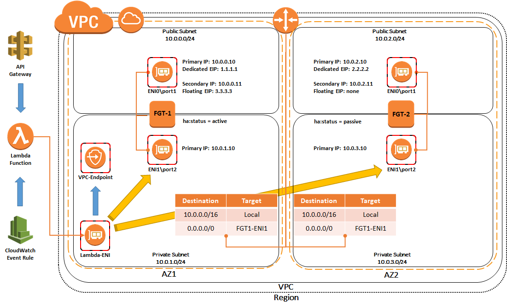

## Solution Components
The solution is comprised of multiple components to provide the overall failover solution:
  - FortiGate Instances
  - Lambda Function
  - Cloud Watch Event Rule
  - API Gateway
  - VPC Endpoint
  - CloudWatch Alarms


### Fortigate Instances
Two FortiGate instances are deployed into separate availability zones with a public and private interface.  The public interface (ENI0\port1) of the instances will be assigned a primary and secondary IP address.  There are dedicated EIPs associated to the primary IP of the public interface (ENI0\port1) for both instances.  There is also a floating EIP that is associated to the secondary IP address of the public interface (ENI0\port1) of the instance tagged as active (FortiGate1 by default).  The private interface (ENI1\port2) of the instances will only have a primary IP address assigned.

Three tags are applied to each instance to identify the pair, the current HA status, and a timestamp.  The 'ha:pair' tag has a string value used by Lambda to uniquely identify the pair of instances ('pair1' by default).  The 'ha:status' tag has a string value of either 'active' or 'passive' to identify which instance is receiving traffic and which is the standby unit.  FortiGate1 is tagged as 'active' and FortiGate2 as 'passive' on template deployment.  The 'ha:time' tag is empty by default but will be updated with a timestamp whenever Lambda updates the AWS SDN for any reason.


### Lambda Function
A single Lambda function is used to perform the TCP health checks and AWS SDN updates when needed.  This Lambda function is configured with environment variables to provide information such as the VPC ID, the expected 'ha:pair' tag value, and TCP port to use for health checks. 

The Lambda function will search for a pair of instances based on the VPC ID and expected 'ha:pair' tag value and identifies the current active and passive instance from the 'ha:status' tag value.  After this, various information about both instances are gathered to perform additional tasks.  For each instance, a list is created for all discovered routes pointing to either ENI0 or ENI1.  Additionally for each instance, a list is created for all currently assigned secondary IPs for ENI0. 

The Lambda function will perform the TCP health checks against the primary IP of ENI1 for both instances starting with the active instance.  If a primary IP for ENI1 is not found, the primary IP of ENI0 will be used instead.  If a 3-way TCP handshake is successfully completed to open and close a session then the instance has passed it's health check, otherwise it is considered a failure.

Depending on the results of the TCP health checks, the Lambda function will perform different tasks:

If the active instance passes the health check and there are routes currently pointing to either ENI0 or ENI1 of the passive instance, the Lambda function will update those routes to point to the corresponding ENI of the active instance.  Then the 'ha:time' tag value is updated with the current timestamp on both instances.

If the active instance fails the health check while the passive instance succeeds, the Lambda function will update routes pointing to either ENI0 or ENI1 of the active instance to the passive instance.  Any EIPs currently associated to the secondary IPs of ENI0 of the active instance will be reassociated to the passive instance.  Then the 'ha:status' tag values are switched to correctly reference the current active and passive instance.  Finally, the 'ha:time' tag value is updated with the current timestamp on both instances.

If both instances fail the health check, the Lambda function will skip all AWS SDN updates.


### CloudWatch Event Rule
A single CloudWatch Event Rule is used to trigger the Lambda function on a scheduled basis (every minute).


### API Gateway
An API Gateway framework is used to allow the Lambda function to be triggered on an adhoc basis with a FortiOS stich action.  The FortiGates are dynamically bootstrapped via the CloudFormation template to use a link monitor to ping each other through the private interface (ENI1\port2).  A stich is also configured which can trigger the Lambda function through the API Gateway when there is a link monitor state change (either up or down).  

**Note:** In order for the FortiOS stich to successfully trigger the lambda function, the secret value of an API key must be manually gathered and updated on both FortiGate instances.

In order to get the secret value of the API Key, you can go to the AWS CloudFormation console, select your stack you just deployed, select the Resources tab in the detail pane for your stack and search for ‘HealthCheckAPIKey’.  Then you can simply click on the resource ID which will be a hyperlink that takes you to the correct page in the AWS API Gateway console.  Once you have the secret value for the API Key, you need to login to both FortiGates, navigate to the existing health check stitch (Security Fabric > Automation > healthcheck-stitch), and update the API Key value. 


### VPC Endpoint
A VPC interface endpoint for EC2 is created so that the Lambda function can access both the AWS EC2 API and the FortiGate instances with private IPs from within your VPC.  

**Note:** The VPC interface endpoint is using private DNS so this requires that your VPC has both DNS Resolution and DNS Hostnames enabled in your VPC settings.  Reference [AWS Documentation](https://docs.aws.amazon.com/vpc/latest/userguide/vpce-interface.html#vpce-private-dns) for further information.


### CloudWatch Alarms
There are a total of three CloudWatch Alarms created by the CloudFormation template.  The first two alarms are to implement AWS EC2 AutoRecovery when the instance status checks fail for 15 consecutive minutes.  Reference [AWS Documentation](https://docs.aws.amazon.com/AWSEC2/latest/UserGuide/ec2-instance-recover.html) for further information.

The final alarm is used to send a notification to administrators when an AWS SDN failover is performed from the active instance to the passive instance.  The CloudFormation template creates an SNS Topic called 'yourstackname-FailoverTopic' and associates the Topic to this alarm.  Additionally a subscription request is sent to the email address provided in the 'Email Notification' parameter of the CloudFormation template.

**Note** an alert is sent when the alarm transitions from 'OK' to 'ALARM' status.  The alarm will stay in 'ALARM' status for at least 15 minutes before returning to an 'OK' status.  Reference [AWS Documentation](https://docs.aws.amazon.com/AmazonCloudWatch/latest/monitoring/AlarmThatSendsEmail.html) for further information.


## Failover Process
The following network diagram will be used to illustrate a failover event from the current active instance (FortiGate1), to the current passive instance (FortiGate2).  Reference the relevant CloudWatch logs showing actions taken for each step in the failover process.

Inbound failover is provided by updating all EIPs associated to the secondary IPs of FortiGate1's public interface to the secondary IPs of FortiGate2's public interface.  Notice that any EIPs associated to the primary IPs of both FortiGates are left as is.  

Outbound failover is provided by updating any routes targeting FortiGate1’s interfaces to reference FortiGate2’s corresponding interface.  This is performed for both ENI0 and ENI1.

The 'ha:status' tags are set to 'passive' on FortiGate1 and 'active' on FortiGate2.  Additionally the 'ha:time' tags of both FortiGates are updated with the current timestamp.

The AWS SDN and tag updates are performed by the Lambda function initiating API calls (from the ENI automatically created by Lambda within the VPC) through the VPC endpoint interfaces.

**Reference Logs:**
```
START RequestId: 67c35a22-ccb6-11e8-a481-918cfd6fd85a Version: $LATEST
[INFO] 2018-10-10T18:00:43.194Z 67c35a22-ccb6-11e8-a481-918cfd6fd85a -=--=--=--=--=--=--=--=--=--=--=--=--=--=--=--=--=--=--=--=-
[INFO] 2018-10-10T18:00:43.194Z 67c35a22-ccb6-11e8-a481-918cfd6fd85a >> Triggered by FortiOS Stitch Action <<
[INFO] 2018-10-10T18:00:43.196Z 67c35a22-ccb6-11e8-a481-918cfd6fd85a Resetting dropped connection: ec2.us-east-2.amazonaws.com
[INFO] 2018-10-10T18:00:43.563Z 67c35a22-ccb6-11e8-a481-918cfd6fd85a --> Found matching instances: ['i-03a6a5fb7a053ef06', 'i-024959355f4acd7a9']
[ERROR] 2018-10-10T18:00:48.698Z 67c35a22-ccb6-11e8-a481-918cfd6fd85a <--!! Exception in get_hc_status: timed out
[INFO] 2018-10-10T18:00:48.699Z 67c35a22-ccb6-11e8-a481-918cfd6fd85a <-- Host+Port 10.0.1.10:541 is UP = False
[INFO] 2018-10-10T18:00:48.700Z 67c35a22-ccb6-11e8-a481-918cfd6fd85a <-- Host+Port 10.0.3.10:541 is UP = True
[ERROR] 2018-10-10T18:00:48.700Z 67c35a22-ccb6-11e8-a481-918cfd6fd85a -->> Active is down but Passive is up: Moving EIPs & routes to Passive
[ERROR] 2018-10-10T18:00:48.700Z 67c35a22-ccb6-11e8-a481-918cfd6fd85a -->> Triggering_CloudWatch_Failover_Alarm
[INFO] 2018-10-10T18:00:49.283Z 67c35a22-ccb6-11e8-a481-918cfd6fd85a --> Updated 13.59.61.226 to target eni-027cb8360fcee7672 10.0.2.11
[INFO] 2018-10-10T18:00:49.439Z 67c35a22-ccb6-11e8-a481-918cfd6fd85a --> Updated 0.0.0.0/0 in rt rtb-0e607a080de8c76d9 to target eni-08c673ac18f5c802d
[INFO] 2018-10-10T18:00:49.757Z 67c35a22-ccb6-11e8-a481-918cfd6fd85a --> Updated tags for active instance: i-024959355f4acd7a9
[INFO] 2018-10-10T18:00:50.19Z 67c35a22-ccb6-11e8-a481-918cfd6fd85a --> Updated tags for passive instance: i-03a6a5fb7a053ef06
[INFO] 2018-10-10T18:00:50.19Z 67c35a22-ccb6-11e8-a481-918cfd6fd85a -=--=--=--=--=--=--=--=--=--=--=--=--=--=--=--=--=--=--=--=-
END RequestId: 67c35a22-ccb6-11e8-a481-918cfd6fd85a 
```

**Reference Diagram:**
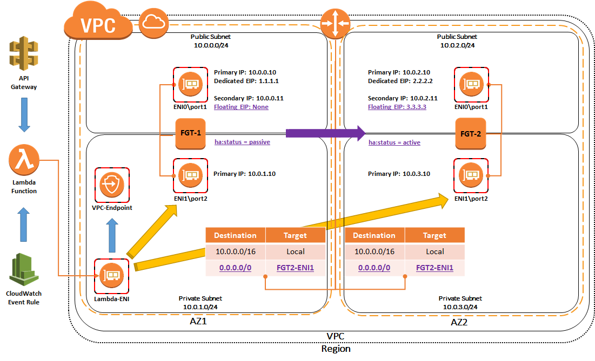

## CloudFormation Templates
There are three CloudFormation templates that can be used for this solution set.
  - [NewVPC_BaseSetup.template](./NewVPC_BaseSetup.template)
  - [FGT_LambdaAP-EIP+RouteFailover_ExistingVPC_BYOL.template.json](./FGT_LambdaAP-EIP%2BRouteFailover_ExistingVPC_BYOL.template.json)
  - [FGT_LambdaAP-EIP+RouteFailover_ExistingVPC_PAYG.template.json](./FGT_LambdaAP-EIP%2BRouteFailover_ExistingVPC_PAYG.template.json)

The first template is optional and deploys a base VPC with a pair of public and private subnets in 2 separate availability zones.  This template can be used to create the expected base VPC architecture for the main two templates.  For example, the VPC will have DNS Resolution and DNS Hostnames options enabled, which is required for the VPC interface endpoint to use private DNS.  Below is an example of the parameters the template will request.

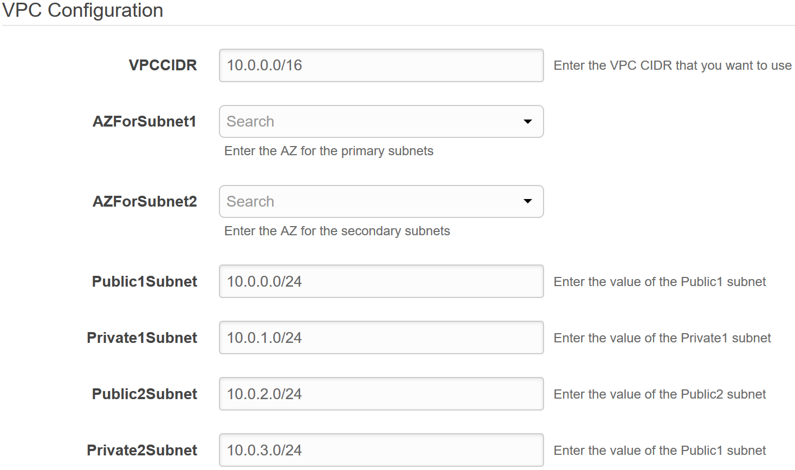

The last two templates will deploy the solution set into an existing VPC with all the required components.  The only difference between these templates is that either BYOL or PAYG FortiGate instances are used.  These templates not only deploy AWS infrastructure but also bootstrap the FortiGate instances with the relevant network and FortiOS stich configuration to support the VPC.  Most of this information is gathered as parameters in the templates when a stack is deployed.  These parameters are organized into these main groups:
  - VPC Configuration
  - FortiGate Instance Configuration
  - Interface IP Configuration for FortiGate1
  - Interface IP Configuration for FortiGate2
  - Lambda Configuration

### VPC Configuration
In this section the parameters will request general information for the existing VPC.  AWS resource IDs will need to be selected for the existing VPC and subnets.  Below is an example of the parameters that both templates will request.

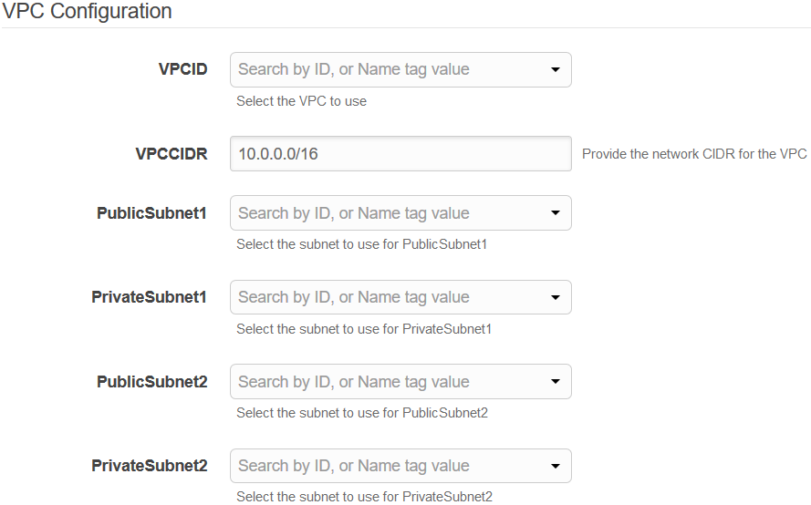

### FortiGate Instance Configuration
For this section the parameters will request general instance information such as instance type, key pair, and availability zone to deploy the instances into.  Also FortiOS specific information will be requested such as the init S3 bucket, bucket region, and FortiGate License filenames if you are using the BYOL template. Additional items such as the IP addresses for AWS resources within the VPC such as the IP of the AWS intrinsic router for the public and private subnets.  The AWS intrinsic router is always the first host IP for each subnet.  Reference [AWS Documentation](https://docs.aws.amazon.com/vpc/latest/userguide/VPC_Subnets.html#VPC_Sizing) for further information on host IPs used by AWS services within a subnet.

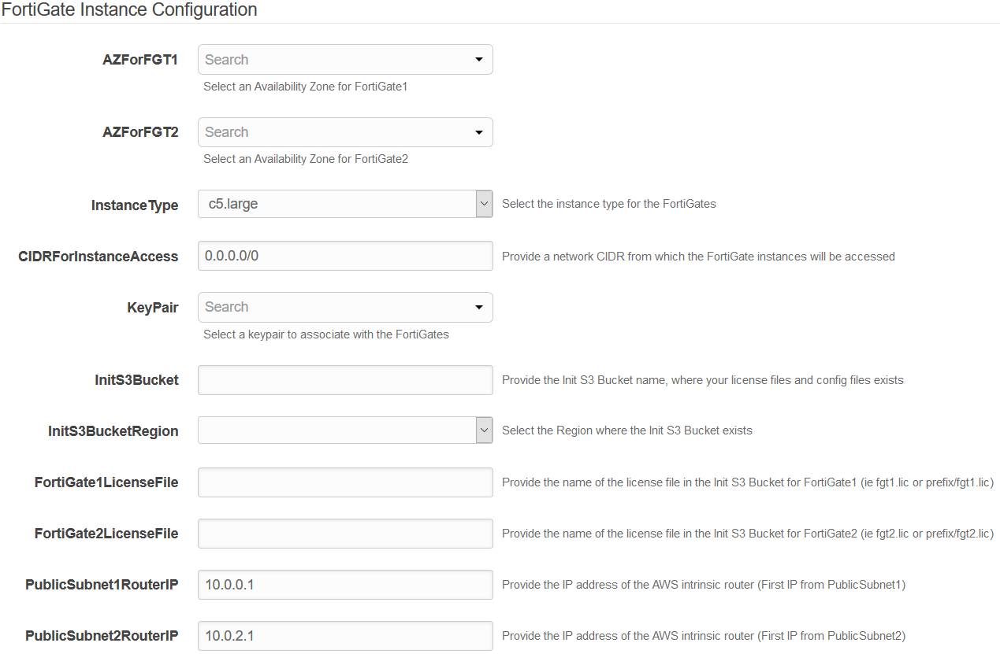

### Interface IP Configuration for FortiGate1 & FortiGate2
The next two sections request IP addressing information to configure the primary and secondary IP addresses of the FortiGate instance ENIs.  This information will also be used to bootstrap the FortiOS configuration for both FortiGates.

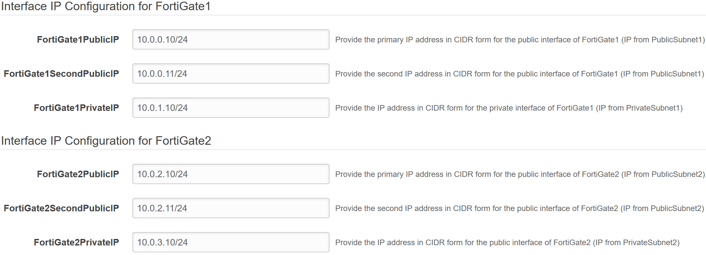

### Lambda Configuration
The last section requests a string value to to uniquely identify the two instances within your VPC, the TCP port to use for health checks, and an email address to subscribe to the SNS Topic used by the failover CloudWatch alarm.

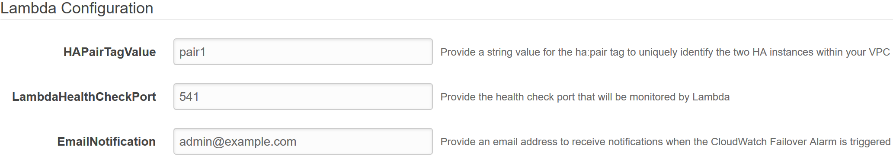


## Deployment
Before attempting to create a stack with the templates, a few prerequisites should be checked to ensure a successful deployment:
1.	An AMI subscription must be active for the FortiGate license type being used in the template.  
  * [BYOL Marketplace Listing](https://aws.amazon.com/marketplace/pp/B00ISG1GUG)
  * [PAYG Marketplace Listing](https://aws.amazon.com/marketplace/pp/B00PCZSWDA)
2.	The solution requires 3 EIPs to be created so ensure the AWS region being used has available capacity.  Reference [AWS Documentation](https://docs.aws.amazon.com/AWSEC2/latest/UserGuide/ec2-resource-limits.html) for more information on EC2 resource limits and how to request increases.
3.	If BYOL licensing is to be used, ensure these licenses have been registered on the support site.  Reference the VM license registration process PDF in this [KB Article](http://kb.fortinet.com/kb/microsites/search.do?cmd=displayKC&docType=kc&externalId=FD32312).
4.  If BYOL licensing is to be used, **create a new S3 bucket in the same region where the template will be deployed** and upload these licenses to the root directory.
5.  If deploying into an existing VPC that was not created with the 'NewVPC_BaseSetup.template', ensure that DNS resolution and DNS hostname support is enabled for the VPC.  Reference [AWS Documentation](https://docs.aws.amazon.com/vpc/latest/userguide/vpce-interface.html#vpce-private-dns) for further information.

Once the prerequisites have been satisfied, download a local copy of the relevant template for your deployment and login to your account in the AWS console.

----
1.  In the AWS services page under All Services > Management Tools, select CloudFormation.


2.  Select Create New Stack.


 
3.  On the Select Template page, under the Choose a Template section select Upload a template to Amazon S3 and browse to your local copy of the chosen deployment template.  In this example, we are using the ‘FGT_LambdaAP-EIP+RouteFailover_ExistingVPC_BYOL.template.json’ template.

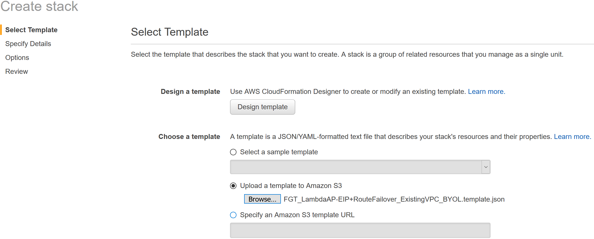

4.  On the Specify Details page, you will be prompted for a stack name and parameters for the deployment.  We are using a AWS resource IDs for a VPC created with the default values of the 'NewVPC_BaseSetup.template' template.

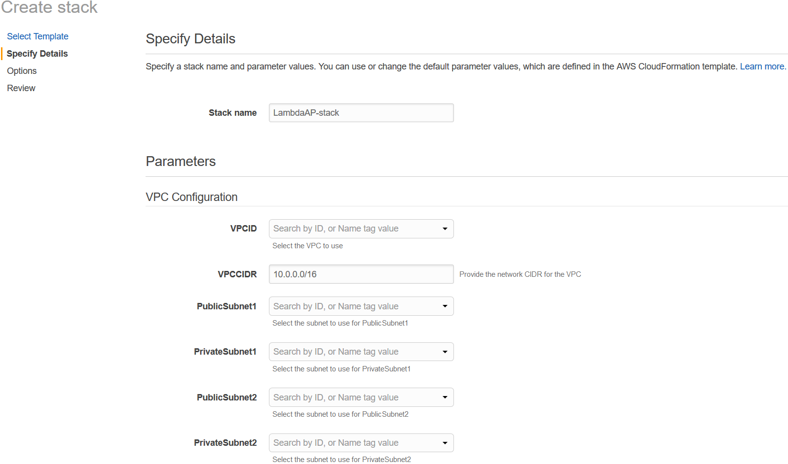

5.  In the FortiGate Instance Configuration parameters section, we have selected an Availability Zone and Key Pair to use for the FortiGates as well as BYOL licensing.  Notice, since we are using a BYOL template we are prompted for the InitS3Bucket, InitS3BucketRegion, FortiGate1LicenseFile, and FortiGate2LicenseFile parameters.  For the values we are going to reference the S3 bucket and relevant information from the deployment prerequisite step 4.

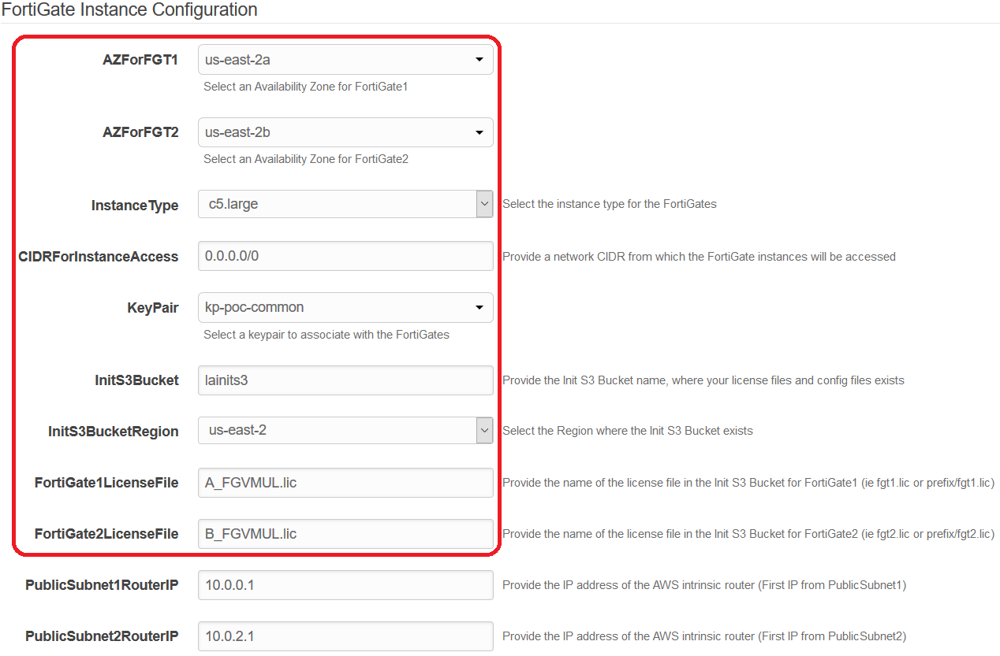

6.  In the Interface IP Configuration for the FortiGates parameters section, we are going with the defaults in this example as the subnet addressing matches.  These IPs will be the primary and secondary IPs assigned to the FortiGate ENIs.  These values will also be used as the static IPs in the FortiOS configuration for both FortiGates.


7.  In the Lambda Configuration parameters section, we have specified a valid email address to use and are going with the defaults values for the rest.

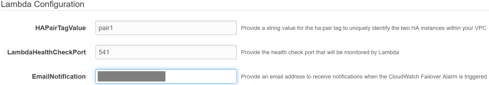

8.  On the Options page, you can scroll to the bottom and select Next.
9.  On the Review page, confirm that the stack name and parameters are correct.  This is what the parameters look like in this example.  Notice the parameter values for the init S3 bucket, bucket region, and FortiGate License filenames.

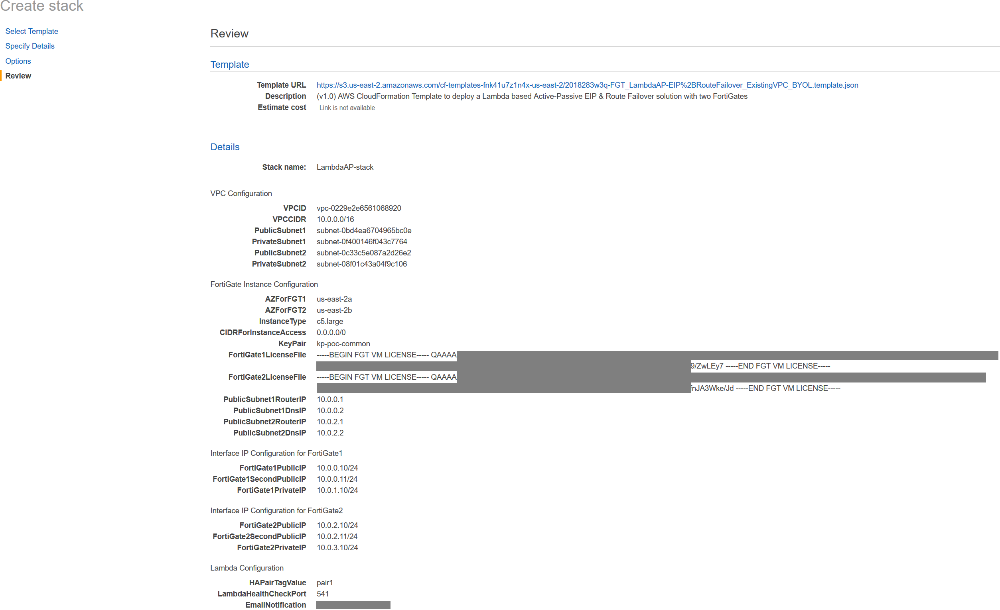

10.  On the Review page, scroll down to the capabilities section.  As the template will create IAM resources, you need to acknowledge this by checking the box next to ‘I acknowledge that AWS CloudFormation might create IAM resources’ and then click Create.

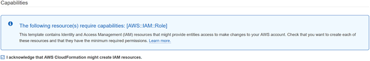

11.  On the main AWS CloudFormation console, you will now see your stack being created.  You can monitor the progress by selecting your stack and then select the Events tab.

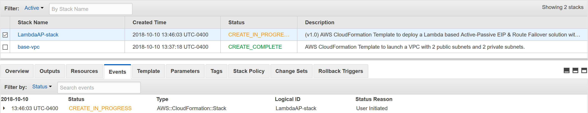

12.  Once the stack creation has completed successfully, select the Resources tab and search for 'HealthCheckAPIKey’, then click on the resource ID which will take you to the AWS API Gateway console.  Click on the 'show' button next to API Key so you can copy the secret API Key value to complete the FortiOS stich configuration.

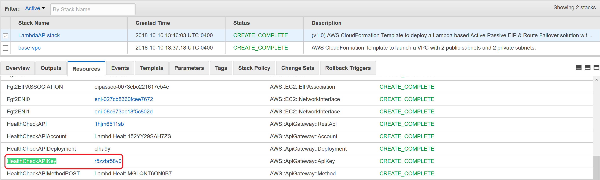

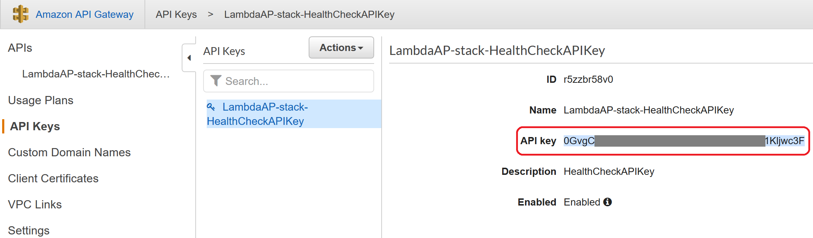

13.  Navigate back to the AWS CloudFormation console and select the Outputs tab to get the login information for the FortiGate instances.

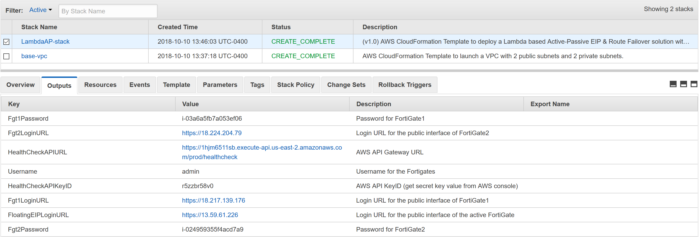

14.  Log into both FortiGates and navigate to (Security Fabric > Automation > healthcheck-stitch), then update the API Key value with the secret key data and save your changes.

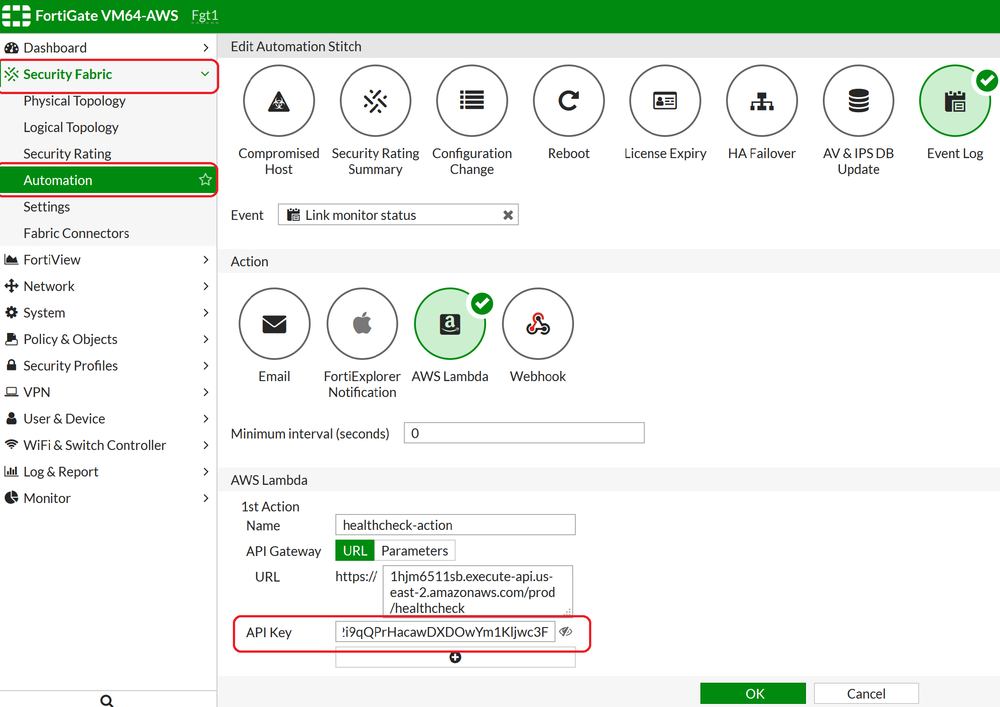

15.  Navigate to the AWS EC2 console and reference the instance Description tab for FortiGate1.  Notice the primary and secondary IPs assigned to the instance ENIs as well as the 2 EIPs associated to the instance, the floating EIP and the dedicated EIP.

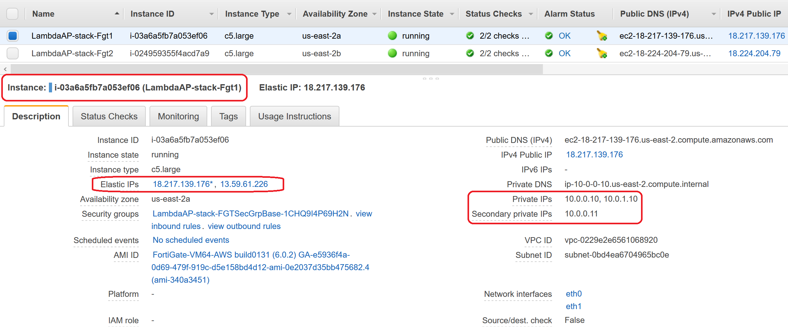

16.  Now reference the instance Description tab for FortiGate2.  Notice the primary and secondary IPs assigned to the instance ENIs as well as the dedicated EIP associated to the instance.


17.  Navigate to the AWS VPC console and look at the routes for the PrivateRouteTable which is associated to the private subnets.  The default route target is pointing to ENI1\port2 of FortiGate1.

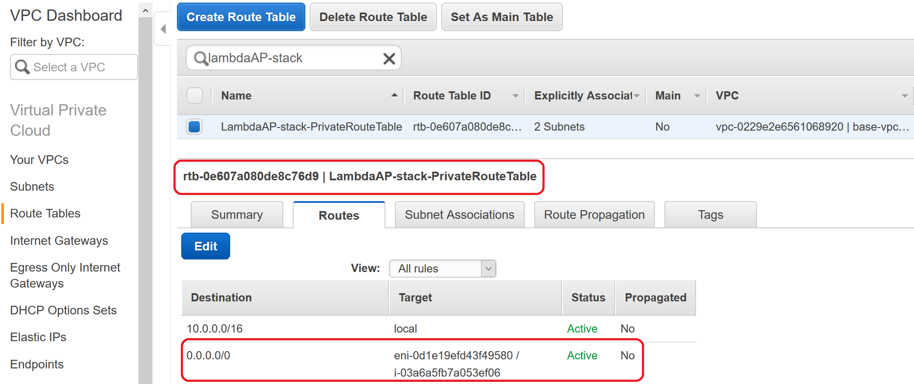

18.  Navigate back to the AWS EC2 console and reference the instance Description tab for FortiGate1.  Now shutdown FortiGate1 via the EC2 console and refresh the page after a few seconds.  Notice that the floating EIP is no longer assigned to FortiGate1 and the tags have been updated.

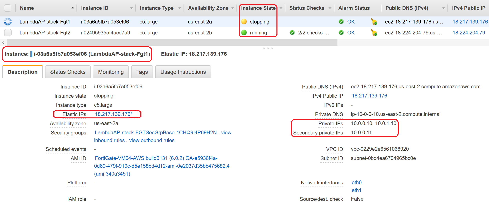

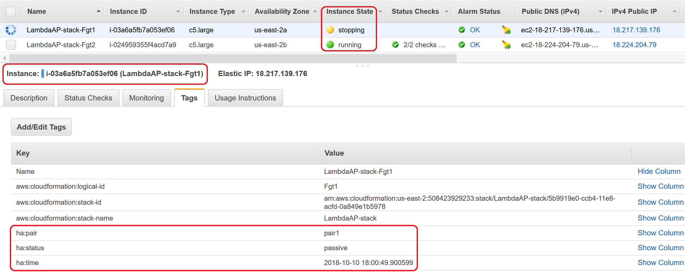

19.  Now reference the instance Description tab for FortiGate2.  Notice that the floating EIP is now associated to FortiGate2 and the tags have been updated.

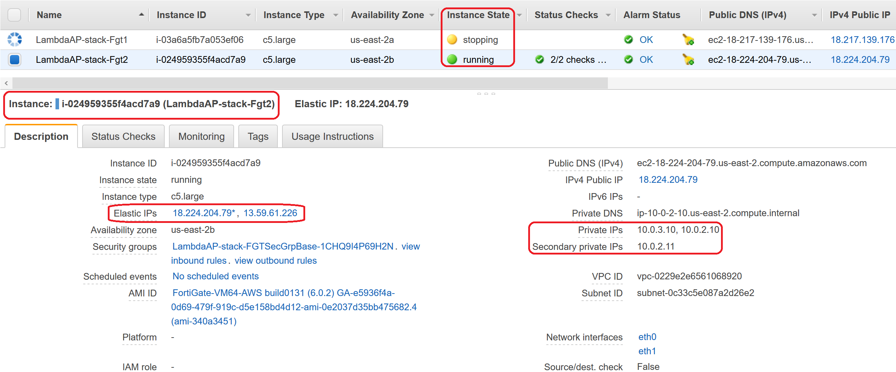

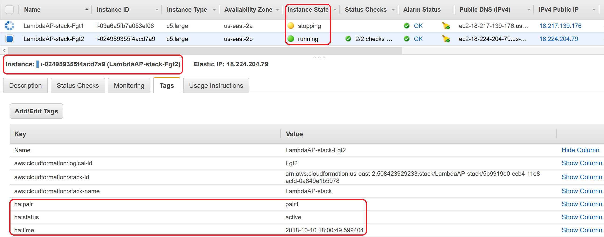

20.  Navigate back to the AWS VPC console and look at the routes for the PrivateRouteTable which is associated to the the private subnets.  The default route target is now pointing to ENI1\port2 of FortiGate2.


21.  Now log back into the FloatingEIPLoginURL and you will be logged into the current active FortiGate, which should now be FortiGate2.

22.  Now power on FortiGate1 and confirm that FortiGate2 continues to be the active FortiGate.

23.  This concludes the template deployment example.
----

## FAQ \ Tshoot
 - **How do I share firewall policy and objects between the FortiGates?**

The FortiGate instances are deployed as standalone instances, however centralized configuration management can be fully provided with the use of a FortiManager and policy packages.  This would allow a single firewall policy package and objects to be deployed to both of the FortiGate instances.

The FortiManager can be an existing physical\virtual appliance or you can deploy a new FortiManager instance.

For further information on FortiManager, such as the Administration Guide or FortiManager to FortiGate compatibility matrix, please visit [docs.fortinet.com](https://docs.fortinet.com/fortimanager/admin-guides) for further information. 

Alternatively, the FortiGates can be fully configured via the GUI, CLI, or API by applying changes to each FGT manually.

  - **Are multiple Failover EIPs supported?**

Yes.  The Lambda function will move over any EIPs associated to the secondary IPs of the active instance's public interface.  In order to configure additional secondary IPs on the public ENI and in FortiOS for port1, reference this [use-case guide](https://www.fortinet.com/content/dam/fortinet/assets/solutions/aws/Fortinet_Multiple_Public_IPs_for_an_AWS_interface.pdf) on the Fortinet AWS micro site.

**Note:** The number of secondary IPs configured on both FortiGate instances public interface should match for EIP failover to work as expected.

  - **Are multiple routes for ENI0 or ENI1 supported?**

Yes.  The Lambda function will move any routes (regardless of the network CIDR) found in any AWS route table(s) for the current VPC that are referencing any of the active instance ENIs.

  - **When I deployed the template, FortiGate2 is the active instance instead of FortiGate1.**

Depending on the when both FortiGate instances fully boot up, FortiGate1 can fail a TCP health check while FortiGate2 passes.  So the Lambda function works as expected and fails over the AWS SDN to reference FortiGate2 in this scenario.

  - **What are the expected CloudWatch logs when both instances are passing health checks?**
```
START RequestId: fe8476db-ccde-11e8-98a5-ff2fe7aec5dc Version: $LATEST
[INFO] 2018-10-10T22:51:16.40Z fe8476db-ccde-11e8-98a5-ff2fe7aec5dc -=--=--=--=--=--=--=--=--=--=--=--=--=--=--=--=--=--=--=--=-
[INFO] 2018-10-10T22:51:16.41Z fe8476db-ccde-11e8-98a5-ff2fe7aec5dc >> Triggered by CloudWatch Scheduled Event <<
[INFO] 2018-10-10T22:51:16.62Z fe8476db-ccde-11e8-98a5-ff2fe7aec5dc Resetting dropped connection: ec2.us-east-2.amazonaws.com
[INFO] 2018-10-10T22:51:16.303Z fe8476db-ccde-11e8-98a5-ff2fe7aec5dc --> Found matching instances: ['i-03a6a5fb7a053ef06', 'i-024959355f4acd7a9']
[INFO] 2018-10-10T22:51:16.420Z fe8476db-ccde-11e8-98a5-ff2fe7aec5dc <-- Host+Port 10.0.1.10:541 is UP = True
[INFO] 2018-10-10T22:51:16.421Z fe8476db-ccde-11e8-98a5-ff2fe7aec5dc <-- Host+Port 10.0.3.10:541 is UP = True
[INFO] 2018-10-10T22:51:16.421Z fe8476db-ccde-11e8-98a5-ff2fe7aec5dc -->> Active is up, Passive is up: Checking routes point to Active
[INFO] 2018-10-10T22:51:16.421Z fe8476db-ccde-11e8-98a5-ff2fe7aec5dc -=--=--=--=--=--=--=--=--=--=--=--=--=--=--=--=--=--=--=--=-
END RequestId: fe8476db-ccde-11e8-98a5-ff2fe7aec5dc 
```

  - **What are the expected CloudWatch logs when the active instance is is up and routes are found pointing to ENI0 or ENI1 of the passive instance?**
```
START RequestId: 220dc11c-ccdf-11e8-b437-23bfba5d6ffb Version: $LATEST
[INFO] 2018-10-10T22:52:15.655Z 220dc11c-ccdf-11e8-b437-23bfba5d6ffb -=--=--=--=--=--=--=--=--=--=--=--=--=--=--=--=--=--=--=--=-
[INFO] 2018-10-10T22:52:15.656Z 220dc11c-ccdf-11e8-b437-23bfba5d6ffb >> Triggered by CloudWatch Scheduled Event <<
[INFO] 2018-10-10T22:52:15.662Z 220dc11c-ccdf-11e8-b437-23bfba5d6ffb Resetting dropped connection: ec2.us-east-2.amazonaws.com
[INFO] 2018-10-10T22:52:15.944Z 220dc11c-ccdf-11e8-b437-23bfba5d6ffb --> Found matching instances: ['i-03a6a5fb7a053ef06', 'i-024959355f4acd7a9']
[INFO] 2018-10-10T22:52:16.72Z 220dc11c-ccdf-11e8-b437-23bfba5d6ffb <-- Host+Port 10.0.1.10:541 is UP = True
[INFO] 2018-10-10T22:52:16.73Z 220dc11c-ccdf-11e8-b437-23bfba5d6ffb <-- Host+Port 10.0.3.10:541 is UP = True
[INFO] 2018-10-10T22:52:16.73Z 220dc11c-ccdf-11e8-b437-23bfba5d6ffb -->> Active is up, Passive is up: Checking routes point to Active
[ERROR] 2018-10-10T22:52:16.73Z 220dc11c-ccdf-11e8-b437-23bfba5d6ffb !!-->> Found routes pointing to Passive ENI1: Moving routes to Active
[INFO] 2018-10-10T22:52:16.210Z 220dc11c-ccdf-11e8-b437-23bfba5d6ffb --> Updated 1.2.3.4/32 in rt rtb-0e607a080de8c76d9 to target eni-0d1e19efd43f49580
[INFO] 2018-10-10T22:52:16.396Z 220dc11c-ccdf-11e8-b437-23bfba5d6ffb --> Updated tags for active instance: i-03a6a5fb7a053ef06
[INFO] 2018-10-10T22:52:16.649Z 220dc11c-ccdf-11e8-b437-23bfba5d6ffb --> Updated tags for passive instance: i-024959355f4acd7a9
[INFO] 2018-10-10T22:52:16.649Z 220dc11c-ccdf-11e8-b437-23bfba5d6ffb -=--=--=--=--=--=--=--=--=--=--=--=--=--=--=--=--=--=--=--=-
END RequestId: 220dc11c-ccdf-11e8-b437-23bfba5d6ffb 
```
